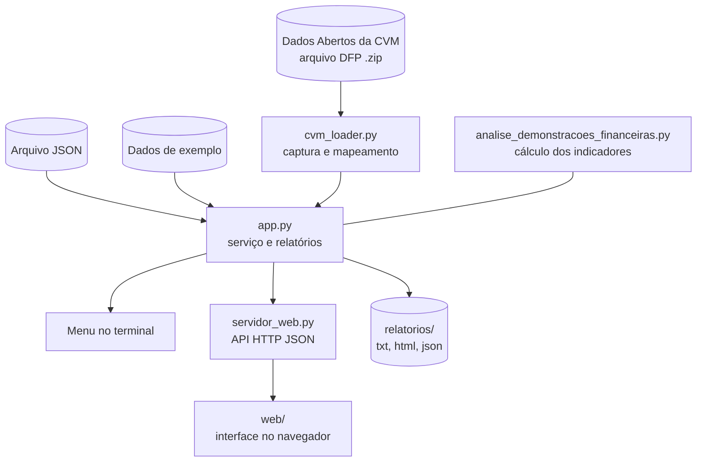

**UNIVERSIDADE FEDERAL DE MINAS GERAIS**  
**FACULDADE DE CIÊNCIAS ECONÔMICAS**  
**DEPARTAMENTO DE CIÊNCIAS ADMINISTRATIVAS – CAD**

Disciplina: Administração Financeira (CAD 167) · Turma: ICEX/SI  
Curso: Sistemas de Informação · Período letivo: 2º semestre de 2026  
Professor: Bruno Pérez Ferreira

# APLICAÇÃO DE ANÁLISE DE DEMONSTRAÇÕES FINANCEIRAS

**Trabalho 1**

**Autores:** Henrique Gustavo Ferreira Silva e Guilherme Novais de Souza

Belo Horizonte  
2026

## Resumo

Este trabalho apresenta o desenvolvimento de uma aplicação em Python para a análise de demonstrações financeiras de companhias abertas brasileiras. A aplicação captura o Balanço Patrimonial, a Demonstração do Resultado do Exercício (DRE) e a Demonstração dos Fluxos de Caixa (DFC) a partir dos Dados Abertos da Comissão de Valores Mobiliários (CVM), calcula 24 indicadores agrupados em cinco módulos (liquidez e capital de giro, lucratividade, eficiência e decomposição DuPont, estrutura de capital e múltiplos de mercado) e gera relatórios em texto, HTML e JSON. O software foi organizado em camadas independentes (dados, cálculo e aplicação), o que permitiu oferecer três formas de uso: interface web, menu em linha de comando e biblioteca. A validação foi feita por conferência manual dos cálculos com um conjunto de dados fictício e por testes de robustez com dados ausentes, divisão por zero, escalas monetárias distintas e reapresentação de demonstrações. O trabalho evidencia como conceitos de Administração Financeira podem ser operacionalizados por um sistema de informação reprodutível.

**Palavras-chave:** análise de demonstrações financeiras; indicadores financeiros; DuPont; dados abertos; Python.

## Sumário

1. [Introdução](#1-introdução)
2. [Fundamentação teórica](#2-fundamentação-teórica)
3. [Desenvolvimento da aplicação](#3-desenvolvimento-da-aplicação)
4. [Resultados e validação](#4-resultados-e-validação)
5. [Atendimento aos critérios do enunciado](#5-atendimento-aos-critérios-do-enunciado)
6. [Limitações e trabalhos futuros](#6-limitações-e-trabalhos-futuros)
7. [Conclusão](#7-conclusão)
8. [Referências](#referências)
- [Apêndice A – Guia de execução](#apêndice-a--guia-de-execução)
- [Apêndice B – Formato dos dados de entrada](#apêndice-b--formato-dos-dados-de-entrada)

## 1. Introdução

### 1.1 Contextualização

A análise de demonstrações financeiras permite avaliar o desempenho passado e a situação atual de uma empresa a partir de informações contábeis, apoiando decisões de crédito, investimento e gestão. Na prática, o cálculo manual dos indicadores é repetitivo e sujeito a erros, sobretudo quando se comparam várias empresas ou exercícios. Sistemas de informação reduzem esse esforço e padronizam os critérios de cálculo.

### 1.2 Problema

Como transformar os conceitos de análise de demonstrações financeiras vistos na disciplina em uma aplicação prática que obtenha dados reais, calcule os indicadores de forma consistente e produza relatórios de fácil verificação?

### 1.3 Objetivos

**Objetivo geral.** Desenvolver uma aplicação que realize a análise de demonstrações financeiras de companhias abertas, constituindo um exemplo prático de um dos temas tratados na disciplina.

**Objetivos específicos.**

- Implementar o cálculo de indicadores de liquidez, lucratividade, eficiência, estrutura de capital e múltiplos de mercado.
- Capturar dados reais a partir de uma fonte pública e oficial (CVM).
- Tratar de forma segura dados ausentes e divisões por zero.
- Gerar relatórios em múltiplos formatos a partir da execução.
- Estruturar o software de modo que o cálculo seja independente da interface, permitindo evoluções futuras.

### 1.4 Justificativa

O enunciado do Trabalho 1 solicita uma aplicação que constitua um exemplo prático de um dos temas da primeira metade do curso (análise de demonstrações financeiras, valor do dinheiro no tempo, ou risco e retorno) e que contemple a execução, a captura de dados, a descrição nos comentários do código e a geração de relatórios. O tema escolhido foi a análise de demonstrações financeiras, por permitir o uso de dados públicos reais e por reunir conceitos centrais da disciplina.

## 2. Fundamentação teórica

### 2.1 Demonstrações financeiras

As companhias abertas brasileiras divulgam demonstrações padronizadas, previstas na Lei nº 6.404/1976 (Lei das Sociedades por Ações) e detalhadas nos pronunciamentos do Comitê de Pronunciamentos Contábeis (CPC). Três delas fundamentam este trabalho:

- **Balanço Patrimonial (BP):** posição patrimonial em uma data, composta por ativos, passivos e patrimônio líquido.
- **Demonstração do Resultado do Exercício (DRE):** receitas, custos, despesas e resultado em um período.
- **Demonstração dos Fluxos de Caixa (DFC):** entradas e saídas de caixa, classificadas em atividades operacionais, de investimento e de financiamento.

### 2.2 Análise por índices

A análise por índices relaciona contas das demonstrações para facilitar a interpretação e a comparação no tempo e entre empresas (GITMAN, 2010). Os índices são agrupados por aspecto avaliado. A aplicação implementa os grupos descritos a seguir. Em todas as fórmulas, "Vendas" refere-se à receita líquida de vendas.

### 2.3 Indicadores implementados

#### 2.3.1 Liquidez e gestão do capital de giro

| Indicador | Fórmula | Interpretação |
|---|---|---|
| Liquidez Corrente | Ativo Circulante / Passivo Circulante | Capacidade de cobrir obrigações de curto prazo com ativos de curto prazo. Valores acima de 1 indicam ativo circulante superior ao passivo circulante. |
| Liquidez Seca | (Ativo Circulante − Estoque) / Passivo Circulante | Versão mais conservadora, que exclui os estoques por serem os ativos circulantes menos líquidos. |
| Prazo Médio de Recebimento (dias) | Contas a Receber / (Vendas / 365) | Tempo médio, em dias, para receber as vendas a prazo. Deve ser comparado ao prazo concedido e ao setor. |
| Giro do Estoque | CMV / Estoque | Número de vezes que o estoque é renovado no período. Giro maior sugere gestão de estoque mais eficiente. |

#### 2.3.2 Lucratividade e rentabilidade

| Indicador | Fórmula | Interpretação |
|---|---|---|
| Margem Bruta | Lucro Bruto / Vendas | Percentual das vendas que sobra após o custo dos produtos vendidos. |
| Margem Operacional | EBIT / Vendas | Resultado das operações, antes de juros e tributos, por unidade de venda. |
| Margem Líquida | Lucro Líquido / Vendas | Parcela das vendas que se converte em lucro após todos os custos, despesas e tributos. |
| EBITDA | EBIT + Depreciação e Amortização | Medida do resultado operacional antes de depreciação e amortização. Aproxima a geração operacional, mas não é fluxo de caixa. |

#### 2.3.3 Eficiência e decomposição DuPont

| Indicador | Fórmula | Interpretação |
|---|---|---|
| Giro do Ativo Total | Vendas / Ativo Total | Quanto a empresa vende para cada unidade monetária investida em ativos. |
| Giro dos Ativos Fixos | Vendas / Ativos Fixos | Eficiência no uso do imobilizado para gerar vendas. |
| ROA | Lucro Líquido / Ativo Total | Retorno gerado pelo conjunto de ativos. |
| ROE | Lucro Líquido / Patrimônio Líquido | Retorno obtido sobre o capital dos acionistas. |

A **análise DuPont** decompõe o ROE em três fatores, mostrando se o retorno decorre de margem, de eficiência no uso dos ativos ou de alavancagem financeira:

$$
ROE = \underbrace{\frac{\text{Lucro Líquido}}{\text{Vendas}}}_{\text{Margem Líquida}} \times \underbrace{\frac{\text{Vendas}}{\text{Ativo Total}}}_{\text{Giro do Ativo}} \times \underbrace{\frac{\text{Ativo Total}}{\text{Patrimônio Líquido}}}_{\text{Multiplicador de Capital}}
$$

Como os termos intermediários se cancelam algebricamente, o produto dos três fatores deve ser idêntico ao ROE calculado diretamente. A aplicação exibe os dois valores, e a igualdade serve como verificação interna de consistência.

#### 2.3.4 Estrutura de capital e alavancagem

| Indicador | Fórmula | Interpretação |
|---|---|---|
| Capital de Terceiros / Capital Próprio | Dívida Total / Patrimônio Líquido | Grau de dependência de recursos de terceiros em relação aos recursos dos acionistas. |
| Cobertura de Juros (TIE, *Times Interest Earned*) | EBIT / Despesas Financeiras | Quantas vezes o resultado operacional cobre as despesas financeiras. |

Nesta aplicação, **Dívida Total** corresponde aos empréstimos e financiamentos de curto e longo prazo. Outras definições (por exemplo, todo o passivo exigível) são possíveis na literatura, e a escolha altera o valor do índice.

#### 2.3.5 Múltiplos e avaliação de mercado

| Indicador | Fórmula | Interpretação |
|---|---|---|
| Lucro por Ação (LPA) | Lucro Líquido / Nº de Ações | Lucro atribuível a cada ação. |
| Valor Contábil por Ação (VPA) | Patrimônio Líquido / Nº de Ações | Patrimônio líquido contábil por ação. |
| Preço/Lucro (P/L) | Preço da Ação / LPA | Quantos anos de lucro atual o mercado paga pela ação. |
| Market-to-Book | Valor de Mercado do PL / Valor Contábil do PL | Relação entre o valor atribuído pelo mercado e o valor contábil. |
| Enterprise Value (EV) | Valor de Mercado do PL + Dívida Total − Caixa | Valor da empresa como um todo, incluindo a dívida e descontando o caixa. |

O valor de mercado do patrimônio líquido é calculado como preço da ação multiplicado pelo número de ações (ROSS; WESTERFIELD; JAFFE, 2015).

### 2.4 Cuidados na interpretação

Indicadores isolados têm pouco significado. Recomenda-se compará-los com o histórico da própria empresa, com empresas do mesmo setor e com a política de crédito e de estoque adotada. Diferenças de critério contábil, sazonalidade e eventos não recorrentes também afetam os resultados.

## 3. Desenvolvimento da aplicação

### 3.1 Requisitos

**Requisitos funcionais**

| Código | Requisito |
|---|---|
| RF1 | Receber BP, DRE e DFC como dicionário Python, arquivo JSON ou dados da CVM |
| RF2 | Calcular os indicadores dos cinco módulos |
| RF3 | Buscar empresas por nome ou CNPJ e capturar suas demonstrações da CVM |
| RF4 | Tratar divisão por zero e dados ausentes sem interromper a execução |
| RF5 | Gerar relatório em console, texto, HTML e JSON |
| RF6 | Oferecer interface web e interface em linha de comando |
| RF7 | Incluir dados fictícios para execução imediata |

**Requisitos não funcionais**

| Código | Requisito |
|---|---|
| RNF1 | Usar apenas a biblioteca padrão do Python, sem dependências a instalar |
| RNF2 | Código documentado em português, com type hints |
| RNF3 | Separação entre captura, cálculo e interface |
| RNF4 | Mensagens de erro compreensíveis para o usuário final |
| RNF5 | Execução reprodutível: dados de entrada salvos junto ao relatório |

### 3.2 Arquitetura

O sistema é dividido em camadas com responsabilidades distintas. A camada de cálculo não conhece a origem dos dados nem a interface, o que permite reutilizá-la em qualquer contexto.



| Arquivo | Camada | Responsabilidade |
|---|---|---|
| `analise_demonstracoes_financeiras.py` | Cálculo | Estruturas de dados das demonstrações, indicadores por módulo e formatação do relatório |
| `cvm_loader.py` | Dados | Download com cache, busca de empresas, leitura dos CSVs da CVM e mapeamento de contas |
| `app.py` | Aplicação | API de serviço (`ResultadoAnalise`), geração de relatórios e menu no terminal |
| `servidor_web.py` | Aplicação | Servidor HTTP com rotas JSON e entrega dos arquivos da pasta `web/` |
| `web/` | Apresentação | Interface web, servida a partir de `index.html` |

### 3.3 Camada de cálculo

**Estruturas de dados.** As demonstrações são representadas por `dataclasses` (`BalancoPatrimonial`, `DRE`, `DFC`, `DadosMercado`), agrupadas em `DadosFinanceiros`. Todos os campos são opcionais. Totais como ativo circulante, ativo total, EBIT e lucro líquido podem ser informados ou derivados das contas componentes, por meio de propriedades.

**Tratamento seguro.** Funções auxiliares (`dividir`, `somar`, `subtrair`, `multiplicar`) devolvem `None` quando falta algum operando ou quando o denominador é zero. O relatório exibe `n/d` (não disponível) nesses casos. A regra evita resultados enganosos: por exemplo, o EBITDA só é calculado se o EBIT e a depreciação e amortização estiverem disponíveis.

**Indicadores.** Cada indicador é um objeto `Indicador` com nome, valor, unidade (`x`, `%`, `dias`, `R$ mil`, `R$/ação`) e fórmula. O analisador (`AnalisadorFinanceiro`) possui um método por módulo e um método que consolida o relatório estruturado.

**Premissas de cálculo.**

1. Saldos de fim de período, sem médias entre exercícios.
2. Ano de 365 dias no prazo médio de recebimento.
3. Giro do estoque calculado sobre o CMV; se o CMV não existir, utiliza as vendas.
4. Dívida total igual a empréstimos e financiamentos de curto e longo prazo.
5. Ativos fixos iguais ao imobilizado.
6. Valores monetários em R$ mil e número de ações em milhares.

### 3.4 Camada de dados: captura na CVM

**Fonte.** O Portal de Dados Abertos da CVM disponibiliza, para as companhias abertas, o arquivo anual de Demonstrações Financeiras Padronizadas (DFP) em formato `.zip`, contendo arquivos CSV por demonstração (BPA, BPP, DRE, DFC) e por escopo (consolidado ou individual) (COMISSÃO DE VALORES MOBILIÁRIOS, 2026).

**Procedimento.**

1. O arquivo do ano é baixado uma única vez e guardado em `cache_cvm/`. Se o download falhar, o programa explica como obter o arquivo manualmente.
2. As empresas são indexadas a partir do Balanço, permitindo busca por parte do nome (sem distinção de acentos ou maiúsculas) ou por CNPJ.
3. Para a empresa escolhida, são lidas apenas as linhas do último exercício (`ORDEM_EXERC` igual a ÚLTIMO) e da versão mais recente do documento, para considerar eventuais reapresentações.
4. O valor de cada conta é convertido para R$ mil conforme `ESCALA_MOEDA` (unidade, mil ou milhão).
5. Os campos de custos e despesas da DRE, negativos na CVM, são convertidos em valores positivos.
6. Se a empresa não publicou demonstrações consolidadas, o programa usa as individuais e avisa o usuário.

Os arquivos são lidos linha a linha, sem carregar o conteúdo inteiro na memória.

**Mapeamento de contas.** A CVM utiliza códigos de conta padronizados, que o programa associa aos campos do cálculo:

| Campo da aplicação | Código CVM | Descrição esperada |
|---|---|---|
| Ativo Total | 1 | Ativo Total |
| Ativo Circulante | 1.01 | Ativo Circulante |
| Caixa | 1.01.01 + 1.01.02 | Caixa e equivalentes + aplicações financeiras |
| Contas a Receber | 1.01.03 | Contas a receber |
| Estoques | 1.01.04 | Estoques |
| Imobilizado | 1.02.03 | Imobilizado |
| Intangível | 1.02.04 | Intangível |
| Passivo Circulante | 2.01 | Passivo Circulante |
| Fornecedores | 2.01.02 | Fornecedores |
| Empréstimos de curto prazo | 2.01.04 | Empréstimos e financiamentos |
| Empréstimos de longo prazo | 2.02.01 | Empréstimos e financiamentos |
| Patrimônio Líquido | 2.03 | Patrimônio líquido |
| Vendas | 3.01 | Receita de venda de bens e serviços |
| CMV | 3.02 | Custo dos bens e serviços vendidos |
| Lucro Bruto | 3.03 | Resultado bruto |
| EBIT | 3.05 | Resultado antes do resultado financeiro e dos tributos |
| Despesas financeiras | 3.06.02 | Despesas financeiras |
| Imposto de renda | 3.08 | IR e CSLL sobre o lucro |
| Lucro Líquido | 3.11 | Lucro/prejuízo do período |
| Fluxo operacional, de investimento e de financiamento | 6.01, 6.02, 6.03 | DFC |

**Depreciação e amortização.** Essa conta não possui código fixo. O programa soma as linhas de depreciação e amortização dos ajustes do lucro no DFC pelo método indireto (contas 6.01.01.xx), excluindo amortizações de custos de captação e itens financeiros. Como o resultado é uma estimativa, o relatório emite aviso, e o EBITDA fica `n/d` quando a conta não é localizada.

**Preço e número de ações.** O preço da ação não consta da DFP e é informado pelo usuário. O número de ações é obtido da CVM, considerando as ações integralizadas menos as mantidas em tesouraria, e a aplicação informa nos avisos o valor utilizado. A CVM informa a quantidade de ações em milhares; a aplicação a converte para unidades e usa milhares no cálculo de LPA, VPA e valor de mercado.

**Verificações de qualidade.** O programa emite avisos quando: (a) a descrição de uma conta-chave difere da esperada; (b) ativo total e passivo total diferem em mais de 0,5%; (c) a empresa parece ser instituição financeira, por usar plano de contas próprio; (d) alguma conta obrigatória não é encontrada; (e) o valor patrimonial por ação resulta fora do usual, o que indica possível erro de unidade no número de ações. Estoques e empréstimos ausentes são considerados iguais a zero, com aviso.

### 3.5 Camada de aplicação

O módulo `app.py` oferece uma **API de serviço** sem interação com o usuário, formada por `analisar_exemplo`, `analisar_json`, `analisar_cvm`, `analisar_dados` e `buscar_empresas`. Todas devolvem um `ResultadoAnalise`, que contém dados de entrada, indicadores por módulo, texto do relatório, fonte e avisos, e que possui o método `para_dict()` para serialização em JSON. A função `salvar_relatorios` grava os arquivos de saída.

Como a lógica não depende da interface, o menu do terminal (`app.py`) e o servidor web (`servidor_web.py`) são apenas camadas de apresentação sobre o mesmo serviço.

### 3.6 Interface web

O módulo `servidor_web.py` usa `ThreadingHTTPServer` da biblioteca padrão. Ele expõe as rotas abaixo e serve os arquivos da pasta `web/`, com `index.html` como página inicial.

| Método | Rota | Função |
|---|---|---|
| GET | `/api/config` | Ano padrão do exercício |
| POST | `/api/dfp/preparar` | Inicia o download da DFP em segundo plano |
| GET | `/api/dfp/status?ano=` | Estado do download: `ausente`, `baixando`, `pronto` ou `erro` |
| GET | `/api/empresas?ano=&termo=` | Busca de empresas (mínimo de 2 caracteres) |
| POST | `/api/analisar/cvm` | Análise de uma empresa da CVM |
| POST | `/api/analisar/dados` | Análise de dados enviados no formato JSON |
| GET | `/api/analisar/exemplo` | Análise dos dados fictícios |

**Relatório na interface.** O resultado é apresentado em cartões de destaque (Liquidez Corrente, Margem Líquida, ROE, EBITDA, Dívida/PL e P/L), seguidos da decomposição DuPont, com verificação automática de que o produto dos três fatores confere com o ROE calculado diretamente. Gráficos mostram a estrutura do balanço, os fluxos de caixa e as margens. Em seguida, tabelas por módulo exibem cada indicador com sua fórmula, e uma lista de avisos informa as limitações dos dados utilizados. Indicadores que não podem ser calculados aparecem como `n/d`, com o motivo indicado.

**Decisões de projeto.**

- O download roda em uma *thread* separada, para a interface exibir o progresso sem travar.
- As entradas são validadas (ano entre 2010 e o ano seguinte ao padrão, números positivos, corpo de requisição limitado a 2 MB), e erros retornam JSON com a chave `erro` e status HTTP apropriado.
- O acesso a arquivos estáticos é restrito à pasta `web/`, evitando a leitura de arquivos fora dela.
- O servidor escuta por padrão em `127.0.0.1`, pois se destina a uso local e acadêmico.

### 3.7 Relatórios

Cada execução pode gerar, em `relatorios/<empresa>/`, os arquivos `relatorio.txt`, `relatorio.html` (autônomo, sem recursos externos), `relatorio.json` (indicadores estruturados) e `dados_entrada.json` (dados capturados, que permitem repetir a análise sem novo download).

## 4. Resultados e validação

### 4.1 Conferência com dados fictícios

O conjunto de dados fictício da "Empresa Teste S.A." (valores em R$ mil) foi usado para conferir os cálculos manualmente. Os valores abaixo coincidem com os produzidos pela aplicação.

**Dados de partida:** Ativo Circulante 620.000; Estoques 200.000; Contas a Receber 280.000; Imobilizado 700.000; Ativo Total 1.500.000; Passivo Circulante 400.000; Dívida Total 520.000 (120.000 de curto prazo e 400.000 de longo prazo); Patrimônio Líquido 600.000; Caixa 120.000; Vendas 2.000.000; CMV 1.200.000; EBIT 350.000; Depreciação e Amortização 90.000; Despesas Financeiras 70.000; Lucro Líquido 184.800; 100.000 mil ações a R$ 18,00.

| Indicador | Cálculo manual | Resultado |
|---|---|---|
| Liquidez Corrente | 620.000 / 400.000 | 1,55x |
| Liquidez Seca | (620.000 − 200.000) / 400.000 | 1,05x |
| Prazo Médio de Recebimento | 280.000 / (2.000.000 / 365) | 51,1 dias |
| Giro do Estoque | 1.200.000 / 200.000 | 6,00x |
| Margem Bruta | 800.000 / 2.000.000 | 40,00% |
| Margem Operacional | 350.000 / 2.000.000 | 17,50% |
| Margem Líquida | 184.800 / 2.000.000 | 9,24% |
| EBITDA | 350.000 + 90.000 | R$ 440.000 mil |
| Giro do Ativo Total | 2.000.000 / 1.500.000 | 1,33x |
| Giro dos Ativos Fixos | 2.000.000 / 700.000 | 2,86x |
| ROA | 184.800 / 1.500.000 | 12,32% |
| ROE | 184.800 / 600.000 | 30,80% |
| DuPont | 9,24% × 1,33 × 2,50 | 30,80% (igual ao ROE) |
| Capital de Terceiros / Próprio | 520.000 / 600.000 | 0,87x |
| Cobertura de Juros (TIE) | 350.000 / 70.000 | 5,00x |
| LPA | 184.800 / 100.000 | R$ 1,85 |
| VPA | 600.000 / 100.000 | R$ 6,00 |
| P/L | 18,00 / 1,848 | 9,74x |
| Market-to-Book | 1.800.000 / 600.000 | 3,00x |
| Enterprise Value | 1.800.000 + 520.000 − 120.000 | R$ 2.200.000 mil |

### 4.2 Testes de robustez da captura

A cadeia de captura foi testada com um arquivo `.zip` sintético, construído com a mesma estrutura de nomes de arquivos e de colunas dos CSVs da CVM. Os cenários verificados e os resultados observados foram:

| Cenário | Resultado |
|---|---|
| Empresa com dados em escala "MIL" e em "UNIDADE" | Valores convertidos corretamente para R$ mil |
| Linhas do exercício anterior (PENÚLTIMO) | Ignoradas |
| Mais de uma versão do documento | Utilizada a versão mais recente |
| Amortização de custos de captação no DFC | Excluída da depreciação e amortização |
| Custos e despesas negativos na DRE | Convertidos em valores positivos |
| Empresa com plano de contas de instituição financeira | Aviso emitido; indicadores indisponíveis aparecem como `n/d` |
| Dados vazios ou denominadores iguais a zero | Execução sem erros, com `n/d` nos indicadores afetados |
| Empresa inexistente ou termo ambíguo | Mensagem de erro clara, sem interrupção abrupta |
| Falha no download | Mensagem com instrução de download manual e uso de `--zip` ou `cache_cvm/` |

Esses testes comprovam a lógica de leitura e de mapeamento. A captura a partir do servidor da CVM foi demonstrada com dados reais no estudo de caso da seção 4.3.

### 4.3 Estudo de caso: Vale S.A.

Para demonstrar a captura de dados reais, a aplicação foi executada pela interface web com a Vale S.A., companhia aberta do setor de mineração. Por não ser instituição financeira, a empresa é adequada aos indicadores implementados. O relatório gerado foi exportado em PDF a partir do navegador.

#### 4.3.1 Parâmetros da execução

| Item | Valor |
|---|---|
| Empresa | Vale S.A. |
| Exercício | Encerrado em 31/12/2025 |
| Fonte dos dados | CVM, DFP 2025 |
| Escopo | Demonstrações consolidadas |
| Unidade monetária | R$ mil |
| Preço da ação | R$ 71,96 (cotação de 30/12/2025) |
| Número de ações | 4.268.779 mil em circulação (4.539.007 mil integralizadas menos 270.228 mil em tesouraria), obtido da CVM |
| Execução | Interface web local, em 05/10/2026 |

A aplicação emitiu dois avisos: a depreciação e amortização foi estimada pela soma das linhas correspondentes do DFC, e o número de ações foi obtido da CVM.

#### 4.3.2 Indicadores calculados

**Liquidez e gestão de capital de giro**

| Indicador | Resultado |
|---|---|
| Liquidez Corrente | 1,15x |
| Liquidez Seca | 0,78x |
| Prazo Médio de Recebimento | 21,6 dias |
| Giro do Estoque | 4,25x |

**Lucratividade e rentabilidade**

| Indicador | Resultado |
|---|---|
| Margem Bruta | 34,98% |
| Margem Operacional | 14,97% |
| Margem Líquida | 5,53% |
| EBITDA | R$ 49.275.000 mil (R$ 49,28 bi) |

**Eficiência e decomposição DuPont**

| Indicador | Resultado |
|---|---|
| Giro do Ativo Total | 0,45x |
| Giro dos Ativos Fixos | 0,89x |
| ROA | 2,48% |
| ROE | 6,25% |
| DuPont: Margem Líquida × Giro do Ativo × Multiplicador de Capital | 5,53% × 0,45x × 2,52x = 6,25% |

O produto dos três fatores confere com o ROE calculado diretamente, o que a própria aplicação verifica e sinaliza no relatório.

**Estrutura de capital e alavancagem**

| Indicador | Resultado |
|---|---|
| Capital de Terceiros / Capital Próprio | 0,55x |
| Cobertura de Juros (TIE) | 3,96x |

**Múltiplos e avaliação de mercado**

| Indicador | Resultado |
|---|---|
| Lucro por Ação (LPA) | R$ 2,77 |
| Valor Contábil por Ação (VPA) | R$ 44,26 |
| Preço/Lucro (P/L) | 26,01x |
| Market-to-Book | 1,63x |
| Valor de Mercado do PL | R$ 307,18 bi |
| Enterprise Value (EV) | R$ 369,01 bi |

#### 4.3.3 Estrutura patrimonial e fluxos de caixa

| Grupo do balanço | Valor (R$ bi) | Participação |
|---|---|---|
| Ativo Circulante | 100,65 | 21% do ativo |
| Ativo Não Circulante | 375,45 | 79% do ativo |
| **Ativo Total** | **476,10** | 100% |
| Passivo Circulante | 87,32 | 18% do total |
| Passivo Não Circulante | 199,85 | 42% do total |
| Patrimônio Líquido | 188,93 | 40% do total |

| Fluxo de caixa | Valor (R$ mil) |
|---|---|
| Operacional | 48.765.000 |
| Investimento | −38.463.000 |
| Financiamento | 1.239.000 |
| **Variação líquida de caixa** | **11.541.000** |

#### 4.3.4 Conferência com fontes externas

Os resultados foram comparados com valores publicados por agregadores de dados de mercado, que também se baseiam em balanços divulgados à CVM.

| Item | Aplicação | Referência externa | Fonte |
|---|---|---|---|
| Lucro líquido de 2025 | R$ 11,81 bi (ROE × Patrimônio Líquido) | R$ 11,8 bi | MEUS DIVIDENDOS |
| ROE | 6,25% | 6,3% | MEUS DIVIDENDOS |
| Margem líquida | 5,53% | 5,5% | MEUS DIVIDENDOS |
| Fluxo de caixa de investimento | −R$ 38,46 bi | −R$ 38,46 bi | HG BRASIL |

Os valores coincidem dentro do arredondamento das fontes. Também há consistência interna: a soma dos três fluxos de caixa (48.765.000 − 38.463.000 + 1.239.000) resulta na variação líquida de 11.541.000, o Passivo Circulante, o Passivo Não Circulante e o Patrimônio Líquido somam o Ativo Total, e o produto dos fatores DuPont reproduz o ROE. Por serem fontes secundárias, recomenda-se confrontar os valores finais com as demonstrações divulgadas no site de Relações com Investidores da companhia.

#### 4.3.5 Análise dos resultados

**Liquidez.** A liquidez corrente de 1,15x indica que o ativo circulante supera em 15% as obrigações de curto prazo. A liquidez seca de 0,78x, inferior a 1, mostra que, desconsiderados os estoques, os ativos circulantes não cobrem integralmente o passivo circulante. Isso sugere dependência da conversão de estoques e da geração de caixa operacional para honrar compromissos de curto prazo. O prazo médio de recebimento de 21,6 dias é curto, e o giro do estoque de 4,25x indica renovação do estoque pouco mais de quatro vezes ao ano.

**Rentabilidade.** A margem bruta de 34,98% e a margem operacional de 14,97% indicam resultado operacional expressivo. A margem líquida, de 5,53%, é bem inferior, porque entre o EBIT e o lucro líquido incidem resultado financeiro, tributos e demais itens, cuja composição não foi detalhada nesta análise. O EBITDA de R$ 49,28 bi é próximo do fluxo de caixa operacional de R$ 48,77 bi, o que sugere boa conversão do resultado operacional em caixa.

**Eficiência e decomposição DuPont.** O giro do ativo total de 0,45x e o giro dos ativos fixos de 0,89x refletem uma atividade intensiva em capital, em que o ativo não circulante representa 79% do ativo. O ROA de 2,48% decorre da combinação de margem líquida moderada e baixo giro. A decomposição DuPont mostra que o ROE de 6,25% resulta de uma margem líquida de 5,53%, de um giro de 0,45x e de uma alavancagem moderada (multiplicador de 2,52x). Assim, o retorno ao acionista é limitado principalmente pelo giro e pela margem líquida, e não pela estrutura de capital.

**Estrutura de capital.** A relação entre dívida total e patrimônio líquido de 0,55x indica que a dívida financeira equivale a pouco mais da metade do capital próprio. O passivo não circulante responde por 42% do financiamento total, o que indica predomínio de recursos de longo prazo. A cobertura de juros de 3,96x mostra que o resultado operacional cobre cerca de quatro vezes as despesas financeiras.

**Fluxos de caixa.** O fluxo operacional de R$ 48,77 bi financiou integralmente os investimentos de R$ 38,46 bi, e a diferença, de cerca de R$ 10,3 bi, ficou disponível antes das atividades de financiamento. O fluxo de financiamento positivo (R$ 1,24 bi) e a variação líquida de caixa de R$ 11,54 bi indicam aumento do caixa no exercício.

**Mercado.** Com o preço de R$ 71,96, o P/L de 26,01x significa que o mercado paga cerca de 26 vezes o lucro por ação de 2025. Um múltiplo elevado pode refletir expectativas de lucros maiores no futuro ou um lucro do exercício abaixo do potencial da empresa, o que só pode ser avaliado com séries históricas. O Market-to-Book de 1,63x indica que o mercado avalia o patrimônio líquido acima de seu valor contábil. O valor da firma (EV), de R$ 369,01 bi, equivale a cerca de 7,5 vezes o EBITDA do exercício, razão calculada a partir dos resultados acima.

#### 4.3.6 Observações metodológicas

- A depreciação e amortização é uma estimativa feita a partir do DFC; o EBITDA depende dela.
- O lucro líquido e o patrimônio líquido são consolidados e incluem a participação de não controladores. O ROE divulgado pela companhia ou por terceiros pode diferir por usar o patrimônio atribuível aos controladores ou saldos médios.
- Os indicadores de balanço usam saldos de fim de período.
- Os múltiplos de mercado dependem do preço de um único dia (30/12/2025) e variam com a cotação.
- Um único exercício não permite avaliar tendências. A análise ganharia consistência com a comparação de vários anos e com empresas do mesmo setor.

## 5. Atendimento aos critérios do enunciado

| Critério de avaliação | Como foi atendido |
|---|---|
| Execução da aplicação | Execução por `python servidor_web.py` ou `python app.py`. A opção de dados fictícios funciona sem internet, e o modo offline permite usar um arquivo da CVM previamente baixado. |
| Utilização de captura de dados | Módulo `cvm_loader.py`, que obtém dados reais da CVM. Também há captura por arquivo JSON e por dicionário Python. |
| Descrição nos comentários do código | Todos os módulos possuem docstrings e comentários explicativos em português, além de type hints. |
| Geração de relatórios | Relatórios em `.txt`, `.html` e `.json`, exibidos também no console e na interface web. |

## 6. Limitações e trabalhos futuros

**Limitações.**

- Somente demonstrações anuais (DFP); as trimestrais (ITR) não são tratadas.
- Instituições financeiras não são suportadas, em razão do plano de contas específico.
- A depreciação e amortização é estimada a partir do DFC, e depende da forma como a empresa apresenta essa informação.
- Indicadores calculados sobre saldos de fim de período, sem médias.
- O preço da ação depende de informação manual.
- Os testes automatizados cobrem a lógica de leitura com dados sintéticos; não há suíte formal de testes unitários.

**Trabalhos futuros.**

- Comparação de múltiplos exercícios e de empresas do mesmo setor, com gráficos de evolução.
- Suporte a demonstrações trimestrais (ITR) e a indicadores calculados sobre médias.
- Obtenção automática de cotações e do número de ações.
- Inclusão de uma suíte de testes unitários e de integração contínua.
- Implementação dos outros temas da disciplina (valor do dinheiro no tempo, risco e retorno) como novos módulos.

## 7. Conclusão

O trabalho atingiu o objetivo de construir uma aplicação que opera os conceitos de análise de demonstrações financeiras sobre dados reais. A organização em camadas separou a captura, o cálculo e a apresentação, o que tornou possível oferecer interface web, linha de comando e biblioteca sem duplicar regras de negócio. A conferência manual dos 24 indicadores e os testes de robustez indicam que o cálculo e o tratamento de dados ausentes se comportam conforme o esperado. O estudo de caso com a Vale S.A. (exercício de 2025) demonstrou o funcionamento de ponta a ponta, da captura na CVM ao relatório, com resultados coerentes com fontes externas. As limitações identificadas, em especial a estimativa da depreciação e amortização e a ausência de dados trimestrais, apontam caminhos claros de evolução. Do ponto de vista da disciplina, a experiência mostrou que a interpretação dos indicadores depende do contexto da empresa e de suas definições contábeis, o que reforça a necessidade de analisá-los em conjunto e com senso crítico.

## Referências

BRASIL. **Lei nº 6.404, de 15 de dezembro de 1976.** Dispõe sobre as Sociedades por Ações. Brasília, DF: Presidência da República, 1976.

COMISSÃO DE VALORES MOBILIÁRIOS (Brasil). **Dados Abertos CVM:** Companhias abertas – Demonstrações Financeiras Padronizadas (DFP). Disponível em: https://dados.cvm.gov.br/. Acesso em: 5 out. 2026.

COMITÊ DE PRONUNCIAMENTOS CONTÁBEIS. **Pronunciamento Técnico CPC 26 (R1):** Apresentação das Demonstrações Contábeis. Brasília, DF: CPC, 2011.

COMITÊ DE PRONUNCIAMENTOS CONTÁBEIS. **Pronunciamento Técnico CPC 03 (R2):** Demonstração dos Fluxos de Caixa. Brasília, DF: CPC, 2010.

GITMAN, Lawrence J. **Princípios de administração financeira.** 12. ed. São Paulo: Pearson Prentice Hall, 2010.

HG BRASIL. **Vale (VALE3).** Disponível em: https://hgbrasil.com/finance/tickers/B3:VALE3. Acesso em: 5 out. 2026.

MEUS DIVIDENDOS. **VALE3: indicadores e resumo financeiro.** Disponível em: https://www.meusdividendos.com/acao/VALE3. Acesso em: 5 out. 2026.

ROSS, Stephen A.; WESTERFIELD, Randolph W.; JAFFE, Jeffrey F. **Administração financeira.** 10. ed. Porto Alegre: AMGH, 2015.

## Apêndice A – Guia de execução

**Requisitos:** Python 3.8 ou superior; nenhum pacote adicional.

```bash
git clone https://github.com/henry-gus/TP1-ADM-FIN.git
cd TP1-ADM-FIN

python servidor_web.py                     # interface web em http://127.0.0.1:8000
python app.py                              # menu no terminal
python app.py --exemplo                    # dados fictícios, sem internet
python app.py --empresa "nome" --ano 2025  # dados reais da CVM
python app.py --json dados.json            # dados de um arquivo JSON
```

**Modo offline.** Copie o arquivo `dfp_cia_aberta_AAAA.zip`, obtido em https://dados.cvm.gov.br/dados/CIA_ABERTA/DOC/DFP/DADOS/, para a pasta `cache_cvm/`, ou use a opção `--zip`.

## Apêndice B – Formato dos dados de entrada

Arquivo JSON com as seções `balanco`, `dre`, `dfc` e `mercado`. Valores monetários em R$ mil; `numero_acoes` em milhares. Campos omitidos resultam em `n/d`.

| Seção | Campos |
|---|---|
| `balanco` | `caixa`, `contas_receber`, `estoques`, `outros_ativos_circulantes`, `ativo_circulante`, `imobilizado`, `intangivel`, `outros_ativos_nao_circulantes`, `ativo_nao_circulante`, `ativo_total`, `fornecedores`, `emprestimos_cp`, `outros_passivos_circulantes`, `passivo_circulante`, `emprestimos_lp`, `outros_passivos_nao_circulantes`, `patrimonio_liquido` |
| `dre` | `vendas`, `cmv`, `lucro_bruto`, `despesas_operacionais`, `depreciacao_amortizacao`, `ebit`, `despesas_financeiras`, `imposto_renda`, `lucro_liquido` |
| `dfc` | `fluxo_operacional`, `fluxo_investimento`, `fluxo_financiamento` |
| `mercado` | `preco_acao`, `numero_acoes` |

Campos de totais (`ativo_circulante`, `ativo_nao_circulante`, `ativo_total`, `passivo_circulante`, `lucro_bruto`, `ebit`, `lucro_liquido`) são opcionais: se omitidos, são calculados a partir das contas componentes.

Exemplo completo: veja a seção 5.2 do [README](README.md).
